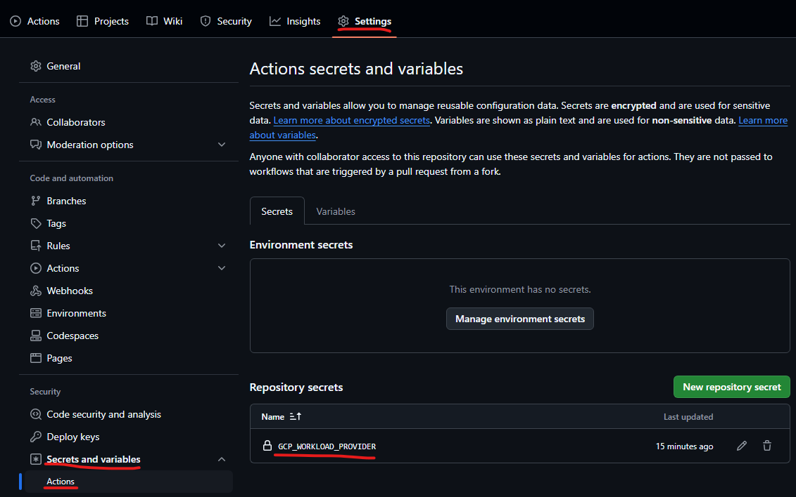

# DevOps GCP

## Prerequisites

- Set up a GCP account ([reference](https://cloud.google.com/docs/get-started))
- Fork this repository to your organization/account ([reference](https://docs.github.com/en/pull-requests/collaborating-with-pull-requests/working-with-forks/fork-a-repo?tool=webui&platform=windows))
- Create and enter a GitHub Codespace for the forked repository in the IDE of your choice ([VS Code](https://docs.github.com/en/codespaces/developing-in-a-codespace/creating-a-codespace-for-a-repository?tool=vscode) or [browser](https://docs.github.com/en/codespaces/developing-in-a-codespace/creating-a-codespace-for-a-repository))

## Initialization

- Press `` CTRL+` `` to open the terminal in the root of the repository.
- Run `bash ./init.sh` to run the initialization script.
- When prompted, log into your GCP as well as your GitHub account using the browser.
- Once the script has executed successfully, you should see a secret called `GCP_WORKLOAD_PROVIDER` created for your GitHub repository ([reference](https://docs.github.com/en/actions/security-for-github-actions/security-guides/using-secrets-in-github-actions#creating-secrets-for-a-repository)):

## Testing

- Create a new branch (e.g.: `feature/new_infrastructure`).
- Extend `main.tf` with IaC configuration that you would like to implement.
- Commit and push your code.
- Navigate to the Actions tab of your GitHub repository to see your running jobs ([reference](https://docs.github.com/en/actions/monitoring-and-troubleshooting-workflows/monitoring-workflows/viewing-workflow-run-history))
- You should see a job named `tf plan`.
- The result of your terraform plan should show up there:

## Backend

> [!CAUTION]
> Without this configuration your pipeline will set up a local backend during runtime which are discarded on a Github-hosted runner after completion!

To set up a backend, you need to follow two more steps during setup:
- Configure the partial backend configuration by replacing `"local"` with your preffered backend in `backend.tf`, e.g.: `gcs`.
- Provide the backend configuration to the GitHub workflow `terraform init` steps (multiple!) so it can use the correct backend. The details should be provided via GitHub secrets and the authentication to the backend should always use identity federation or other secure alternatives!
